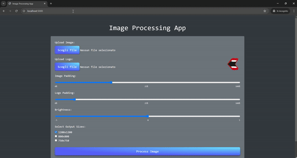

# Image Background Remover and Logo Adder Web App

This Flask-based web application allows users to upload an image and a logo, adjust image padding, logo padding, and brightness, and then receive an output image with the background removed. The processed image has the main object centered, and the uploaded logo placed in the upper right corner with user-specified padding.

## Features

- **Image Upload**: Upload an image for processing.
- **Logo Upload**: Add a logo that will be placed on the processed image.
- **Background Removal**: Automatically removes the background of the uploaded image.
- **Adjustments Available**:
  - Image padding
  - Logo padding
  - Image brightness
- **Output**: Produces an image with a transparent background, the main object centered, and the logo positioned in the upper right corner.

## App Demo



## Setup Instructions

1. **Create and activate a Virtual Environment**

   ```bash
   python3 -m venv venv
   source venv/bin/activate ## On Unix or MacOS
   venv\Scripts\activate    ## On Windows
   ```

2. **Install dependencies**

   ```bash
   pip install -r requirements.txt
   ```
   
3. **Run the application**

   ```bash
   flask run
   ```
3. **Open the application in a browser**
